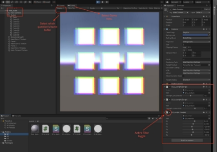
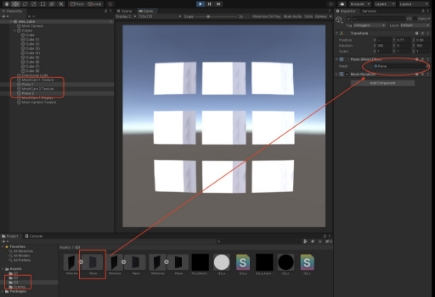

# Virtual reality engineering task
This project revolved around simulating and correcting the distortions created by the lenses in visual reality headsets. Correcting these distortions is computationally expensive, and the lag experienced by the user when their machine is both running the game/visualisation results in VR sickness. Here I wrote C# and GLSL/HLSL shader code to simulate these distortions and also correct them.

You can open these simulations in the provided unity project directory.

The report attached explains my implementation, observations and comments on the project in detail.

## Launch Unity and open the project folder in this repo.

1. Click Play!
1. Go to Game view, and select one of Display 1,2,3.

a. Display 1 outputs the requirements of Problem 1 & 2 As seen below;

i. Select “Main camera” from the hierarchy menu in order to manipulate fragment shader pre and post correction by toggling their checkbox in the inspector menu.

ii. You can also control the aggressiveness of the distortion and correction.

2. Display 2 outputs the pre-distortion filter for Problem 3.
2. Display 3 outputs the corrected image as if it went through the lens for q3 (c).

Changing the mesh Size

1. Navigate to Display 2 or 3
1. Select the two planes as shown below from the project hierarchy.
1. Navigate to Assets/Q3 under the project tab.
1. Drag the desired complexity mesh’s plane from the assets available to the highlighted location in the inspector menu (the plane (mesh) attribute),

# The assignment outline was as follows:
$$
\begin{array}{l}
r=\sqrt{x^{2}+y^{2}} \\
\theta=\operatorname{atan} 2(y, x)
\end{array}
$$
Brown’s simplified Forward radial transform:
$$ r_{d}=f\left(r_{u}\right)=r_{u}+c_{1} r_{u}^{3}+c_{2} r_{u}^{5}$$
Brown’s simplified Inverse radial transform:
$$f^{-1}\left(r_{d}\right) \approx \frac{c_{1} r_{d}^{2}+c_{2} r_{d}^{4}+c_{1}^{2} r_{d}^{4}+c_{2}^{2} r_{d}^{8}+2 c_{1} c_{2} r_{d}^{6}}{1+4 c_{1} r_{d}^{2}+6 c_{2} r_{d}^{4}}$$
### PROBLEM 0: SETTING UP THE SCENE - 5 MARKS:
For all problems, you will use the same simple scene. The scene should contain 9 white rotating cubes,
arranged on a 3x3 grid on the default Unity skybox, covering the entire field-of-view. The frustum and
view-port should be square. The cubes should be rotating, completing a revolution every 2 seconds.

### PROBLEM 1: PIXEL-BASED PRE-DISTORTION IN THE FRAGMENT SHADER - 25 MARKS:
For this problem you will implement pincushion distortion pre-correction in the fragment shader by
warping the frame buffer appropriately. Assuming that the lens is radially symmetric, the pincushion
distortion can be described as a stretching of the image that becomes increasingly severe away from the
optical axis.
1. To correct the pincushion distortion effect, you will need to apply an appropriate transformation
so that the light emitted by the screen reaches the eye undistorted. Use the simplified radial
distortion model mentioned above. The actual parameters you use do not matter but the inverse
distortion generated should be clearly visible (not subpixel...). **[10 marks]**
2. You will perform (as in most VR software) this reverse distortion by rendering the scene camera
into a separate render target (render texture) and then projecting that texture on a full-screen quad
while warping the texture in the fragment shader. You will then display the full-screen quad on
the output. **[15 marks]**
### PROBLEM 2: CORRECTING LATERAL CHROMATIC ABERRATION - 10 MARKS:
For this problem you will implement lateral chromatic aberration (LCA) pre-correction. LCA is an
artifact inherent to VR lenses. LCA is caused by red, green, and blue light refracting through lenses
differently (wavelength-dependence). A white pixel on the panels will refract through the lenses and
separate into red, green, and blue pixels visible to the viewer.
LCA correction aims to adjust for this by pre-distorting the rendered image in the opposite way so that
the image viewed by the user after lens refraction appears as a single white pixel as intended. LCA
artifacts usually look like opposing red and blue color fringes emanating from the center of the optics.
To correct for LCA you will implement the inverse of the expected colour-dependent magnification
of the image in a shader and show the result on screen. Pick parameters that make the inverse colour
fringing visible (not subpixel...). Actual values do not matter as this is for demonstration purposes only.
PROBLEM 3: MESH-BASED PRE-DISTORTION IN THE VERTEX SHADER - **[30 MARKS]**:
For this problem you will implement pre-distortion in the vertex shader to take advantage of optimisations in the rendering pipeline potentially leading to high performance gains.
1. You will use a square mesh (plane made of triangles) which you will pre-distort in the vertex
shader (displace its vertices in world space) and then the scene camera’s output will be projected
onto the warped mesh (applied as a texture) and the mesh rendered to the screen using another
camera. **[15 marks]**
2. Use Blender to create three different meshes of different geometric complexity that will be used
for full screen rendering. Comment on the effect the different mesh geometric complexities have
on pre-distortion quality. Use the Unity Profiler to actually measure performance impact and
describe what you found in the report. **[10 marks]**
3. Finally invert the output (unwarp the pre-distorted image as if it had gone through the lens),
again using the mesh-based method, and compare it to the original image. What do you see?
Answer the relevant questions asked in problem 4. **[5 marks]**
### PROBLEM 4: RESEARCH REPORT - 30 MARKS:
The main purposes of the research report is to include evidence of testing, provide images/answers to
the questions below, and comment on anything else that you consider important.
1. Produce static renders for the report, where all 9 cubes are rotated 45 degrees around the y-axis,
showing the inverse chromatic aberration pre-correction, the barrel distortion in the fragment
shader and the barrel distortion using the pre-calculated mesh. **[6 marks]**
2. What are the advantages and disadvantages of pixel-based and mesh-based undistortion methods?
Comment on the accuracy of pixel-based vs mesh-based approaches and their effect on visual
quality. Comment on the performance of both methods, i.e., comment on the expected number
of calculations and texture lookups for each method based on the frame buffer resolution that
you have used. Comment on the effect that the number of vertices in the mesh has on rendering
quality. **[8 marks]**
3. Would eye tracking help for any of these distortions? If so, how? If not, why not? **[6 marks]**
3
4. When performing barrel distortion, some parts of the image are compressed in a smaller real
estate in the image, other parts are expanded. What would this cause? Suggest potential fixes.
For a given display panel resolution, would you suggest the rendering resolution to be equal to
the hardware resolution, less or more and why? Further comment on apparent resolution, how
detailed a scene ’appears’ to be or is expected to be following all these transformations. Discuss
the ramifications that this could have in modern headsets. **[10 marks]**
