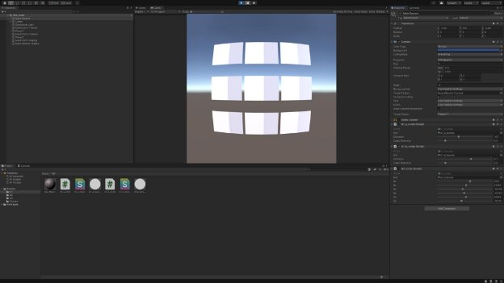
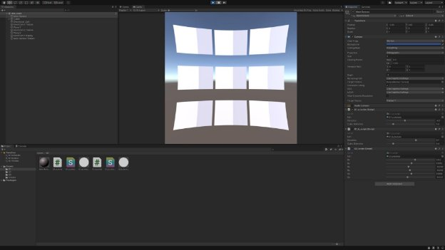
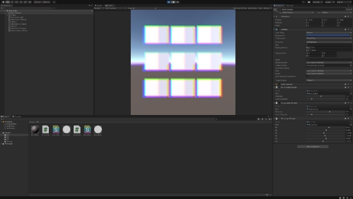
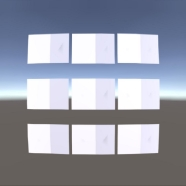
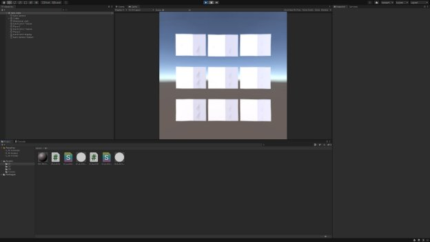
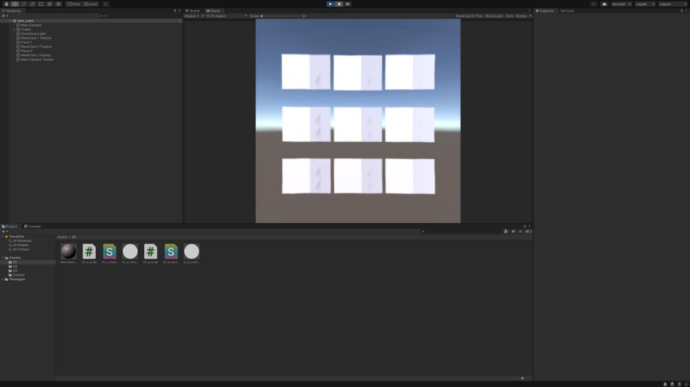

# Virtual And Augmented Reality Summative Report VQWH89

## Section 1: Static Renders

**Figure 1.0** The Barrel distortion effect of the scene made by distorting the provided transform in the fragment shader every pixel’s position in the fragment shader.

**Figure 1.1** Distorting the scene producing the pincushion effect

**Figure 2.0** the inverse chromatic aberration pre-correction.

 
**Figure 3.0** The Pre-distortion of the scene.The scene is projected onto a **Figure 3.1** The correction of the distorted scene 3.0, also using vertex mesh, using vertex shader code to distort the mesh’s vertices. shader code and a separate mesh which is wrapped in the output of the scene in 3.0.

## Section 2: Comparing the lens correction methods used

There is an accuracy performance trade-off in the choice of these two methods. There are performance gains made in using the mesh based approach. However using meshes with fewer than 10 vertices results in unwarped images with cubes that do not retain a perfect structure i.e. they appear as a distorted cuboid with some extrusions becoming increasingly apparent as the radial distance increases from the centre of the image (this can be seen below).

Figure 4.0, An imperfectly corrected part of the distorted image when correcting using the mesh based method with too few vertices.

The pixel based method using the vertex shader results in near perfect accuracy when unless the pre distorted scene is too aggressively stretched, in which case there are optical aberrations that result from the reverse transformation. The metrics provided in the Unity Profiler showed a consistent GPU performance of 15ms 60 FPS on pre and post correction shaders in the respective implementations, the resolution used was 720x720. The CPU time in the pixel-based method is 5ms lower than the mesh based (15.1ms and 20.2ms respectively), however it also appears to use a greater amount of memory (approximately 210MB compared to 180MB using the mesh based method using a 40 x 40 grid). One significant difference is in image quality, both methods were tested using adequate resolution, however the apparent resolution from the mesh based approach was significantly less. The output of the mesh-based approach appeared less sharp and for instance, the cube's texture appeared smoothed out and lacking in contrast with the skybox behind. On the used resolution $720 \times 720=518400$ calculations are made in the pixel based solution; however the mesh based one only requires $40 \times 40=1600$ calculations on a $40 \times 40$ grid. The application of the distorted image as a texture on this mesh is an expense on the rendering time.

## Section 3: Eye Tracking

view-dependent lens correction addresses a design flaw in VR headsets in that the observer’s eye cannot be assumed to target the optical axis of the lens at all times; their gazes advert to different angles meaning each eye receives a different level of optical distortion. This unbalance of the lens distortion experienced may contribute to VR sickness. The direction of the eye is known, the pre distortion filter may adjust the centre of the radial distortion to correspond to a new origin. The CLA distortion would not benefit from eye tracking since the lenses are calibrated and require no further correction.

## Section 4: Further Discussion

The barrel distortion may result in parts of the image being lost when they go through the lens, if the image is too compressed it will in effect result in a loss of detail which translates to lower apparent resolution. This is because vertices effectively blend into one another as they are bundled together, where the pixel based method would give slightly higher definition. In all cases the use of lenses always results in a lower apparent resolution compared to the un-magnified screen in the headset. These lenses are very thick in order to provide a large field of view required in VR, so one potential solution may be higher pixel density on compact screens in order to provide greater resolution, alternatively the large FOV in headsets may be sacrificed for weight, mass production and improved apparent resolution using existing hardware. It would be unnecessary to output a resolution greater than the hardware resolution since the bottleneck on the perceived resolution is in effect the lower pixel density seen after the pixels on the screen are stretched.
